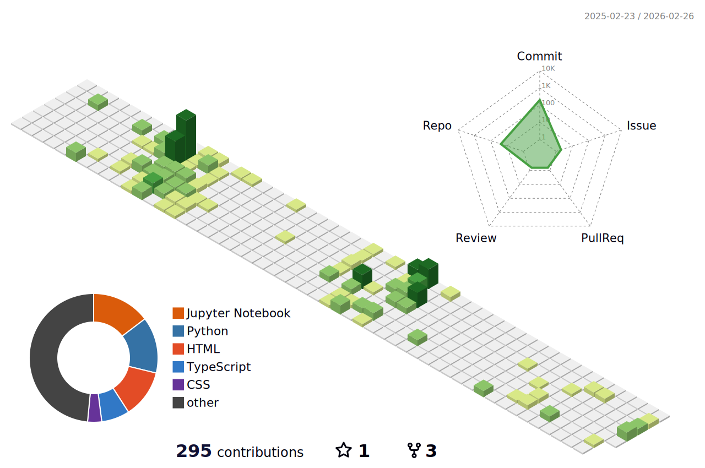

<!-- GitHub README for Divyanshu Dubey -->

<h1 align="center">Hi 👋, I'm Divyanshu Dubey</h1>
<h3 align="center">Full Stack Developer | AI & ML Enthusiast | 2nd Year @ IIT Madras</h3>

  

  

---

## 🔥 About Me

- 🎓 BS in Data Science @ IIT Madras (2nd Year)
- 🧑‍🏫 Founder of a growing tuition institute with 100+ students
- 💡 Passionate about **AI**, **Automation**, and **Web3**
- 💻 Tech Explorer | Pythonista | Frontend + Backend Dev
- 🎸 Music Lover – EDM producer & Guitarist

---

## 🧰 Tech Stack

  

---

## 🚀 GitHub Highlights

### 🧠 GitHub Stats

  
  

### 🐍 Contribution Snake

  

### 🧩 GitHub Metrics

  

### 🏆 GitHub Trophies

  

### 💬 Daily Quote & Joke

  
   
  

---

## 🌟 Featured Projects
| Project | Description |
|--------|-------------|
| [🔐 Role-Based Access Control](https://github.com/Divyanshu1Dubey/Role-Based-Access-Control) | Node.js backend with RBAC, image uploads, and secure views |
| [🧠 Neural Network in Jupyter](https://github.com/Divyanshu1Dubey/NeuralNetwork) | Built a simple feedforward neural net from scratch |
| [🌐 Hackathon Code PU](https://github.com/Divyanshu1Dubey/PU_Code_-Hackathon-2.O) | Frontend + backend solution for a hackathon |
| [📱 iPhone 16 Teaser](https://github.com/Divyanshu1Dubey/iPhone-16-release) | Stylish landing page for hypothetical iPhone release |
| [🛡️ Cyber Awareness Portal](https://github.com/Divyanshu1Dubey/hackthon) | HTML project promoting safe digital habits |

---

## 🎯 2025 Goals

- [x] Build 20+ GitHub projects
- [x] Win 2 Hackathons
- [ ] Publish 3 Technical Blogs
- [ ] Launch a SaaS product
- [ ] Contribute to 10+ Open Source Repos

---

## 📰 Weekly Dev Breakdown
<!--START_SECTION:waka-->
<!--END_SECTION:waka-->

---

## 🔗 Connect With Me

  
  
  

---

## 📺 YouTube Preview

  

---

## 📰 DevCard

  

---

  

  

