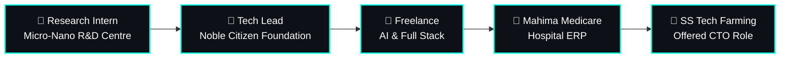

<!-- ═══════════════════════════════════════════════════════════════════════════════════════════════════════ -->
<!-- 🔥 DIVYANSHU DUBEY - THE ULTIMATE GITHUB PROFILE 🔥 -->
<!-- ═══════════════════════════════════════════════════════════════════════════════════════════════════════ -->

<div align="center">

<!-- ANIMATED HEADER WITH HOLOGRAPHIC WAVE -->


<!-- DYNAMIC ROLE BADGES -->
<p>
  
  
  
</p>

<!-- ANIMATED TYPING SVG -->
<a href="https://github.com/Divyanshu1Dubey">

</a>

<!-- EDUCATION & RECOGNITION BADGES -->
<p>
  
  
  
  
</p>

<!-- PROFILE VIEWS & SOCIAL PROOF -->
<p>
  
  <a href="https://github.com/Divyanshu1Dubey?tab=followers">
    
  </a>
  
</p>

<!-- CONNECT BUTTONS - PREMIUM STYLE -->
<p>
  <a href="https://linkedin.com/in/divyanshu-dubey-123abc" target="_blank">
    
  </a>
  <a href="mailto:divyanshudubey2712@gmail.com">
    
  </a>
  <a href="https://divyanshudubey.netlify.app/" target="_blank">
    
  </a>
  <a href="tel:+919601981524">
    
  </a>
</p>

</div>

<!-- ═══════════════════════════════════════════════════════════════════════════════════════════════════════ -->
<!-- TERMINAL-STYLE INTRO -->
<!-- ═══════════════════════════════════════════════════════════════════════════════════════════════════════ -->

```js
// 🚀 whoami
const divyanshu = {
    education: ["B.S. Data Science @ IIT Madras", "B.Tech CSE @ Parul University | 9.1 CGPA"],
    currentRole: "Research Intern @ Micro-Nano R&D Centre",

    expertise: {
        ai_ml: ["TensorFlow", "PyTorch", "GBRNN", "LSTM", "SHAP", "XGBoost", "Random Forest"],
        fullStack: ["React", "Next.js", "Node.js", "Django", "Flask", "FastAPI"],
        databases: ["PostgreSQL", "MongoDB", "MySQL", "Redis"],
        tools: ["Docker", "Azure", "Power BI", "Tableau", "CST Suite"]
    },

    achievements: {
        jeeAdvanced: "Qualified with 96%ile | 98.14 in Mathematics",
        viteee: "All India Rank 7123 / 200,000+ candidates",
        hackathons: "2x Winner | Smart India Hackathon Finalist",
        intel: "Elite Student Cohort - Unnati Industrial Training"
    },

    currentlyBuilding: ["Enterprise Hospital ERP (250+ daily orders)", "AI-Driven AgriTech Platform"],
    funFact: "I've debugged code for 12+ hours straight and still called it 'fun' 🔥"
};
```

<!-- ═══════════════════════════════════════════════════════════════════════════════════════════════════════ -->
<!-- 💼 WHAT I DO - VISUAL CARDS -->
<!-- ═══════════════════════════════════════════════════════════════════════════════════════════════════════ -->

<h2 align="center">
  
  What I Do
</h2>

<div align="center">
<table>
<tr>
<td width="50%">

### 🧠 AI & Machine Learning
```yaml
Research:
  - CSIR-backed ML projects
  - Perovskite energy prediction
  - GBRNN, LSTM, SHAP analysis
  - 5-fold & 10-fold validation
  - Bayesian hyperparameter tuning

Production Systems:
  - Disease prediction (94.8% acc)
  - X-ray image diagnosis
  - RAG pipelines with FAISS
  - NLP-based document Q&A
```

</td>
<td width="50%">

### 🚀 Full Stack & SaaS
```yaml
Enterprise Products:
  - Hospital ERP System
    • 250+ daily orders
    • 100+ patient appointments
    • Multi-role: Admin, Doctor,
      Patient, Pharmacist, Lab

  - AgriTech AI Platform
    • Predictive analytics
    • Real-time ML insights
    • Offered CTO role
```

</td>
</tr>
</table>
</div>

<!-- ═══════════════════════════════════════════════════════════════════════════════════════════════════════ -->
<!-- 🛠️ TECH ARSENAL -->
<!-- ═══════════════════════════════════════════════════════════════════════════════════════════════════════ -->

<h2 align="center">
  
  Tech Arsenal
</h2>

<div align="center">

<!-- Core Languages -->
<br/>

<!-- Frameworks & Libraries -->
<br/>

<!-- Databases & Cloud -->
<br/>

<!-- AI/ML & Tools -->


</div>

<br/>

<div align="center">

<!-- Additional Tool Badges -->


</div>

<!-- ═══════════════════════════════════════════════════════════════════════════════════════════════════════ -->
<!-- 🏆 ACHIEVEMENTS & RECOGNITION -->
<!-- ═══════════════════════════════════════════════════════════════════════════════════════════════════════ -->

<h2 align="center">
  
  Achievements & Recognition
</h2>

<div align="center">
<table>
<tr>
<td align="center" width="25%">
<br/>
<b>96 Percentile</b><br/>
<sub>98.14 in Mathematics</sub>
</td>
<td align="center" width="25%">
<br/>
<b>Top 200,000+</b><br/>
<sub>Candidates All India</sub>
</td>
<td align="center" width="25%">
<br/>
<b>Elite Student</b><br/>
<sub>Industrial Training</sub>
</td>
<td align="center" width="25%">
<br/>
<b>International Olympiad</b><br/>
<sub>of Science</sub>
</td>
</tr>
</table>

<br/>

<!-- HACKATHON WINS BANNER -->


</div>

<!-- ═══════════════════════════════════════════════════════════════════════════════════════════════════════ -->
<!-- 💼 PROFESSIONAL EXPERIENCE -->
<!-- ═══════════════════════════════════════════════════════════════════════════════════════════════════════ -->

<h2 align="center">
  
  Professional Experience
</h2>

<div align="center">


```mermaid
graph LR
    A[🔬 Research Intern<br/>Micro-Nano R&D Centre] --> B[💼 Tech Lead<br/>Noble Citizen Foundation]
    B --> C[🚀 Freelance<br/>AI & Full Stack]
    C --> D[🏥 Mahima Medicare<br/>Hospital ERP]
    D --> E[🌾 SS Tech Farming<br/>Offered CTO Role]

    style A fill:#0d1117,stroke:#00ffe0,stroke-width:2px,color:#fff
    style B fill:#0d1117,stroke:#00ffe0,stroke-width:2px,color:#fff
    style C fill:#0d1117,stroke:#00ffe0,stroke-width:2px,color:#fff
    style D fill:#0d1117,stroke:#00ffe0,stroke-width:2px,color:#fff
    style E fill:#0d1117,stroke:#00ffe0,stroke-width:2px,color:#fff
```

</div>

<details>
<summary><b>🔬 Research Intern @ Micro-Nano R&D Centre</b> <i>(Click to expand)</i></summary>
<br/>

> CSIR-backed research applying cutting-edge ML to high-dimensional scientific datasets

- Built ML pipelines with **GBRNN, LSTM, SHAP** for perovskite energy prediction
- Implemented **5-fold & 10-fold cross-validation** with Bayesian hyperparameter tuning
- Leveraged **CST Studio Suite** for simulation-driven data generation
- Contributed to high-impact scientific publications

</details>

<details>
<summary><b>💼 Tech & Web Team Lead @ Noble Citizen Foundation</b> <i>(Click to expand)</i></summary>
<br/>

> End-to-end web architecture leadership

- Migrated WordPress → Flask for enhanced performance & backend control
- Integrated secure donation systems & dynamic content modules
- Automated event management workflows boosting digital outreach

</details>

<details>
<summary><b>🚀 Freelance AI & Full Stack Developer</b> <i>(Click to expand)</i></summary>
<br/>

> Building production-ready SaaS platforms and AI agents

| Project | Impact |
|---------|--------|
| **Mahima Medicare** | Hospital ERP: 250+ daily orders, 100+ appointments, 5 role modules |
| **SS Tech Farming** | AI-driven agritech with predictive analytics — Offered CTO role |
| **Multiple SaaS** | Working platforms, agents, and enterprise automation tools |

</details>

<!-- ═══════════════════════════════════════════════════════════════════════════════════════════════════════ -->
<!-- 🚀 FLAGSHIP PROJECTS -->
<!-- ═══════════════════════════════════════════════════════════════════════════════════════════════════════ -->

<h2 align="center">
  
  Flagship Projects
</h2>

<div align="center">
<table>
<tr>
<td width="50%">

<h3 align="center">🏥 FirstCall - AI Healthcare Assistant</h3>
<div align="center">
<a href="https://github.com/Divyanshu1Dubey/FirstCall" target="_blank">

</a>
<p>


</p>
</div>

```
✅ Multi-disease prediction engine
✅ X-ray image diagnosis system
✅ Medicine recommendation AI
✅ Pharmacy geolocation services
✅ Real-time video consultation
```

</td>
<td width="50%">

<h3 align="center">🤖 AI-Powered Tutor System</h3>
<div align="center">
<a href="https://github.com/Divyanshu1Dubey/Intel_Unnati_AI_tutor_project1" target="_blank">

</a>
<p>


</p>
</div>

```
✅ Personalized outcome predictions
✅ NLP-based document Q&A
✅ Real-time content recommendations
✅ RAG pipeline with Streamlit
✅ PDF querying capabilities
```

</td>
</tr>
<tr>
<td width="50%">

<h3 align="center">🌾 AgriSens & SS Tech Farming</h3>
<div align="center">
<a href="https://github.com/Divyanshu1Dubey/AgriSens" target="_blank">

</a>
<p>


</p>
</div>

```
✅ AI-driven crop analysis
✅ Predictive & prescriptive analytics
✅ Real-time ML decision engine
✅ Operational automation insights
✅ Full-stack TypeScript architecture
```

</td>
<td width="50%">

<h3 align="center">🔐 Enterprise RBAC System</h3>
<div align="center">
<a href="https://github.com/Divyanshu1Dubey/Role-Based-Access-Control-main" target="_blank">

</a>
<p>


</p>
</div>

```
✅ Strict RBAC policy enforcement
✅ Encrypted routing system
✅ Secure image upload handling
✅ Multi-tenant architecture
✅ Production-ready security
```

</td>
</tr>
</table>
</div>

<!-- More Projects Link -->
<p align="center">
<a href="https://github.com/Divyanshu1Dubey?tab=repositories">

</a>
</p>

<!-- ═══════════════════════════════════════════════════════════════════════════════════════════════════════ -->
<!-- 📊 GITHUB STATISTICS -->
<!-- ═══════════════════════════════════════════════════════════════════════════════════════════════════════ -->

<h2 align="center">
  
  GitHub Analytics
</h2>

<!-- Stats Cards Row -->
<p align="center">
  
  
</p>

<!-- Language Stats -->
<p align="center">
  
</p>

<!-- Activity Graph -->
<p align="center">
  
</p>

<!-- Profile Summary Cards -->
<p align="center">
  
</p>

<p align="center">
  
  
  
</p>

<!-- ═══════════════════════════════════════════════════════════════════════════════════════════════════════ -->
<!-- 🌌 3D CONTRIBUTION VISUALIZATION -->
<!-- ═══════════════════════════════════════════════════════════════════════════════════════════════════════ -->

<h2 align="center">
  
  3D Contribution Universe
</h2>

<p align="center">
  
</p>

<details>
<summary align="center"><b>🎨 More 3D Visualizations</b></summary>
<br/>

<p align="center">
  
  
</p>

<p align="center">
  
  
</p>

</details>

<!-- ═══════════════════════════════════════════════════════════════════════════════════════════════════════ -->
<!-- 🐍 CONTRIBUTION SNAKE -->
<!-- ═══════════════════════════════════════════════════════════════════════════════════════════════════════ -->

<h2 align="center">
  
  Watch The Snake Eat My Contributions
</h2>

<p align="center">
  
</p>

<!-- ═══════════════════════════════════════════════════════════════════════════════════════════════════════ -->
<!-- 🏆 TROPHIES -->
<!-- ═══════════════════════════════════════════════════════════════════════════════════════════════════════ -->

<h2 align="center">
  
  Trophy Cabinet
</h2>

<p align="center">
  
</p>

<!-- ═══════════════════════════════════════════════════════════════════════════════════════════════════════ -->
<!-- 🎯 2025-26 GOALS -->
<!-- ═══════════════════════════════════════════════════════════════════════════════════════════════════════ -->

<h2 align="center">
  
  2025-26 Mission Control
</h2>

<div align="center">
<table>
<tr>
<td>

### Completed ✅
- [x] Build 30+ GitHub projects
- [x] Win 2 Major Hackathons
- [x] Land Research Internship
- [x] Get offered CTO role at startup
- [x] CSIR-backed ML publications

</td>
<td>

### In Progress 🚀
- [ ] Launch first SaaS product
- [ ] Publish 3 AI/ML research papers
- [ ] Contribute to 10+ major OSS repos
- [ ] Build personal ML framework
- [ ] 1000+ GitHub followers

</td>
</tr>
</table>
</div>

<!-- ═══════════════════════════════════════════════════════════════════════════════════════════════════════ -->
<!-- 💡 RANDOM DEV QUOTE -->
<!-- ═══════════════════════════════════════════════════════════════════════════════════════════════════════ -->

<h2 align="center">
  
  Random Dev Wisdom
</h2>

<p align="center">
  
</p>

<!-- ═══════════════════════════════════════════════════════════════════════════════════════════════════════ -->
<!-- 🤝 LET'S CONNECT -->
<!-- ═══════════════════════════════════════════════════════════════════════════════════════════════════════ -->

<h2 align="center">
  
  Let's Build Something Amazing
</h2>

<div align="center">

```
┌──────────────────────────────────────────────────────────────────────┐
│                                                                      │
│   💼 Open for:                                                       │
│      • Research Collaborations (AI/ML, Deep Learning)               │
│      • Full-Stack Development Projects                               │
│      • AI Integration & Consulting                                   │
│      • Startup Technical Co-founding                                 │
│                                                                      │
│   📧 divyanshudubey2712@gmail.com                                   │
│   📱 +91-9601981524                                                  │
│   🌐 https://divyanshudubey.netlify.app                             │
│                                                                      │
└──────────────────────────────────────────────────────────────────────┘
```

<p>
  <a href="https://linkedin.com/in/divyanshu-dubey-123abc">
    
  </a>
  <a href="mailto:divyanshudubey2712@gmail.com">
    
  </a>
  <a href="https://divyanshudubey.netlify.app/">
    
  </a>
</p>

</div>

<!-- ═══════════════════════════════════════════════════════════════════════════════════════════════════════ -->
<!-- ⭐ STAR CALL TO ACTION -->
<!-- ═══════════════════════════════════════════════════════════════════════════════════════════════════════ -->

<div align="center">

---


<br/><br/>

<!-- Animated Footer -->


</div>

<!-- ═══════════════════════════════════════════════════════════════════════════════════════════════════════ -->
<!-- 👁️ HIDDEN EASTER EGG -->
<!-- ═══════════════════════════════════════════════════════════════════════════════════════════════════════ -->

<!--
███████╗ █████╗ ███████╗████████╗███████╗██████╗     ███████╗ ██████╗  ██████╗
██╔════╝██╔══██╗██╔════╝╚══██╔══╝██╔════╝██╔══██╗    ██╔════╝██╔════╝ ██╔════╝
█████╗  ███████║███████╗   ██║   █████╗  ██████╔╝    █████╗  ██║  ███╗██║  ███╗
██╔══╝  ██╔══██║╚════██║   ██║   ██╔══╝  ██╔══██╗    ██╔══╝  ██║   ██║██║   ██║
███████╗██║  ██║███████║   ██║   ███████╗██║  ██║    ███████╗╚██████╔╝╚██████╔╝
╚══════╝╚═╝  ╚═╝╚══════╝   ╚═╝   ╚══════╝╚═╝  ╚═╝    ╚══════╝ ╚═════╝  ╚═════╝

You found the Easter Egg! 🥚
Contact me for: Collaborations, Research, Consulting, or just to chat about tech!
-->
